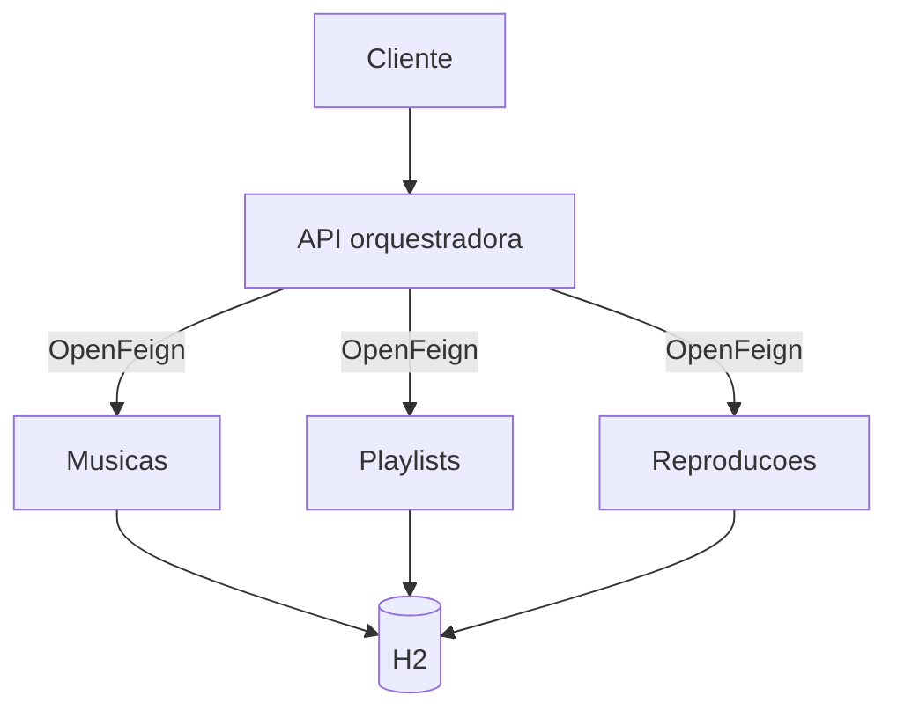

# Play Your List - MS-AV-01

API REST em Java e Spring Boot para montagem e execução de playlists do sistema
HPWM (*High Productivity With Music*).

Embora o cenário represente quatro microserviços, o enunciado solicita que todos
os endpoints sejam implementados no mesmo projeto. Por isso, as responsabilidades
foram separadas por pacotes, mas a aplicação é executada em uma única porta.

## Arquitetura



## Tecnologias

- Java 17;
- Spring Boot 4.1.1;
- Spring Web;
- Spring Data JPA;
- Bean Validation;
- H2 em memória;
- Spring Cloud OpenFeign 5.0.3;
- Maven;
- JUnit 5.

## Como executar

No Linux/Kubuntu:

```bash
chmod +x mvnw
./mvnw spring-boot:run
```

No Windows:

```powershell
mvnw.cmd spring-boot:run
```

A API estará disponível em `http://localhost:8080`.

### Console H2

Acesse `http://localhost:8080/h2-console` e informe:

| Campo | Valor |
| --- | --- |
| JDBC URL | `jdbc:h2:mem:playyourlist` |
| User Name | `sa` |
| Password | `password` |

## Endpoints implementados

### Músicas

| Método | Endpoint | Resultado esperado |
| --- | --- | --- |
| POST | `/musicas` | Cria uma música e retorna 201 |
| GET | `/musicas` | Lista todas as músicas |
| GET | `/musicas/{id}` | Busca por ID ou retorna 404 |
| PUT | `/musicas/{id}` | Atualiza uma música existente |
| DELETE | `/musicas/{id}` | Exclui a música e retorna 204 |

### Playlists

| Método | Endpoint | Resultado esperado |
| --- | --- | --- |
| POST | `/playlists` | Cria uma playlist |
| GET | `/playlists` | Lista todas as playlists |
| GET | `/playlists/{playlistid}` | Busca uma playlist |
| PUT | `/playlists/{playlistid}` | Atualiza nome e descrição |
| DELETE | `/playlists/{playlistid}` | Exclui vínculos e a playlist |
| POST | `/playlists/{playlistid}/musicas/{musicaId}` | Adiciona música |
| DELETE | `/playlists/{playlistid}/musicas/{musicaId}` | Remove música |
| GET | `/playlists/{playlistid}/musicas` | Lista somente IDs |

### Reproduções

| Método | Endpoint | Resultado esperado |
| --- | --- | --- |
| POST | `/reproducao` | Registra data e hora atuais |
| GET | `/reproducao/{playlistid}` | Lista as reproduções |
| GET | `/reproducao/total/{playlistid}` | Retorna a contagem |
| POST | `/statistic` | Alias usado pelo OpenFeign |

Corpo do POST:

```json
{
  "playlistid": 1
}
```

### API orquestradora

| Método | Endpoint | Integração |
| --- | --- | --- |
| POST | `/api/adicionar/{playlistId}/musicas/{musicaId}` | Valida música e playlist por OpenFeign e cria o vínculo |
| PUT | `/api/executar/{playlistId}` | Valida a playlist e chama `POST /statistic` por OpenFeign |

## Validações

As entidades usam Bean Validation e os controllers recebem o corpo com `@Valid`.
Erros de validação retornam HTTP 400 em um JSON no formato `campo: mensagem`.

| Campo | Validação |
| --- | --- |
| `titulo` | `@NotBlank` e máximo de 150 caracteres |
| `artista` | `@NotBlank` e máximo de 150 caracteres |
| `album` | Opcional e máximo de 150 caracteres |
| `duracao` | `@NotNull` e `@Positive` |
| `genero` | Opcional e máximo de 50 caracteres |
| `nome` da playlist | `@NotBlank` e máximo de 100 caracteres |
| `descricao` | Opcional e máximo de 255 caracteres |

## Tratamento de erros

| Status | Quando ocorre |
| --- | --- |
| 400 | Corpo JSON viola uma validação |
| 404 | Música, playlist ou associação não existe |
| 409 | Música já está associada ou há conflito de integridade |

O tratamento é centralizado em `GlobalExceptionHandler`.

## Testes

Execute:

```bash
./mvnw clean test
```

Os testes verificam:

- carga dos dados iniciais;
- regras de validação;
- inclusão e remoção de música em playlist;
- integração real entre os endpoints por OpenFeign;
- criação de uma reprodução pelo orquestrador.

O arquivo `requests.http` contém uma sequência de testes manuais. No VS Code,
ele pode ser executado com a extensão REST Client; também é possível copiar as
requisições para o Postman ou Thunder Client.

## Organização dos pacotes

```text
br.com.playyourlist
├── api            # Orquestrador e clientes OpenFeign
├── erros          # Exceções e tratamento global
├── musicas        # CRUD de músicas
├── playlists      # CRUD e associação playlist-música
└── reproducoes    # Registro e estatísticas de execução
```

## Observação sobre `/statistic`

O enunciado lista `POST /reproducao`, mas pede que o endpoint de execução use
`POST /statistic`. Os dois caminhos foram implementados. O cliente OpenFeign do
orquestrador chama `/statistic`, atendendo literalmente à regra, enquanto
`/reproducao` permanece disponível conforme a lista principal de endpoints.

## Checklist antes da entrega

- [ ] `./mvnw clean test` termina com `BUILD SUCCESS`;
- [ ] o workflow **Testes Java** aparece verde no GitHub Actions;
- [ ] todos os endpoints do `requests.http` foram conferidos;
- [ ] nenhum arquivo da pasta `target` foi enviado ao Git;
- [ ] o README aparece corretamente no GitHub;
- [ ] o repositório está público ou o professor recebeu acesso;
- [ ] o link entregue abre diretamente no projeto correto.
